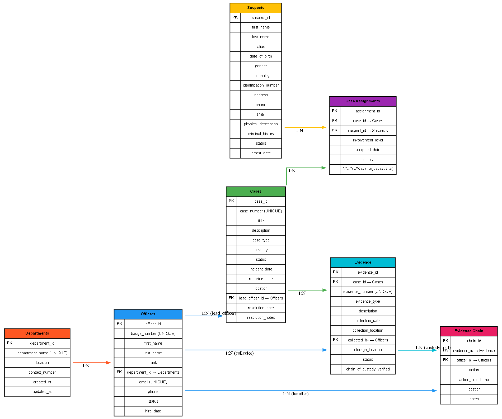

# 🚔 Crime Record & Investigation Database

## 📌 Introduction
This project is a **PostgreSQL database system** designed for **law enforcement agencies** to manage criminal investigations, evidence tracking, suspect profiles, and case management.

We implement:
- **7 normalized tables** with foreign key relationships
- **6 automated triggers** for evidence chain of custody
- **5 analytical views** for performance metrics
- **20 pre-built queries** for investigation analytics

## 🚀 How to Run
1. Install **PostgreSQL 12+**
2. Create database: `createdb crime_investigation_db`
3. Run scripts in order:
```bash
psql -d crime_investigation_db -f schema.sql
psql -d crime_investigation_db -f data.sql
psql -d crime_investigation_db -f queries.sql
psql -d crime_investigation_db -f triggers.sql
psql -d crime_investigation_db -f views.sql
psql -d crime_investigation_db -f indexes.sql

```
4. Verify: `psql -d crime_investigation_db -c "SELECT * FROM cases LIMIT 5;"`

## 📂 Files
- `schema.sql` → Database schema (7 tables, indexes, constraints)
- `triggers.sql` → 6 triggers for automation
- `views.sql` → 5 analytical views
- `queries.sql` → 20 analysis queries
- `data.sql` → Sample dataset 
- `queries.md` → Complete query documentation
- `PROJECT_REPORT.html` → 2-page project report

## 📊 Database Schema

### Core Tables
- **departments** → Police departments and units
- **officers** → Law enforcement personnel
- **cases** → Criminal investigations (auto-generated case numbers)
- **suspects** → Suspect profiles and criminal history
- **case_assignments** → Links suspects to cases (many-to-many)
- **evidence** → Physical/digital evidence (auto-generated evidence numbers)
- **evidence_chain** → Chain of custody tracking

### Key Views
- `officer_workload` → Active cases and solve rates per officer
- `case_summary` → Comprehensive case overview with statistics
- `solved_cases_analysis` → Resolution time and performance
- `unsolved_cases_analysis` → Open cases with priority levels
- `evidence_tracking` → Chain of custody verification

## 📊 ER Diagram


**View Full Diagram:** Use GraphViz with `er_diagram.dot`

## 🔧 Key Features
- **Auto-generate** case numbers (`CASE-YYYY-NNNNNN`)
- **Auto-generate** evidence numbers (`EVD-CASE_NUM-NNNN`)
- **Automated** chain of custody tracking
- **foreign key relationships** for data integrity
- **indexes** for query performance

## ✅ Outcome
After completing this, you'll be able to:
- Design **normalized relational databases** with proper constraints
- Implement **automated triggers** for business logic
- Create **analytical views** for reporting
- Write **complex SQL queries** with joins and subqueries
- Maintain **complete audit trails** for compliance
- Generate **performance metrics** and reports
